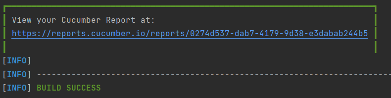

**_Rest API Testing using Rest Assured, Cucumber and TestNG_**

This is a sample application to demonstrate how to test Rest API using Rest Assured, Cucumber with TestNG.

1. This framework consists of:

Rest Assured – 5.4.0
Java 17
Cucumber – 7.18.0
TestNG - 7.10.2
Maven – 3.9.6
Maven Compiler Plugin - 3.13.0

2. To run the tests through command line, use the command
````
mvn clean test
````

3. Reports - This framework generates a Cucumber Report. The location will be mentioned at the end of the test execution as shown in the below image.


4. TestNG Reports are generated in test-output folder.